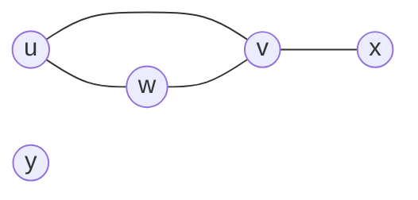

Topics: 
- - -
==(Neusmerjen, enostaven) graf==: urejen par $G=(V,E)$:
- $V$ ... neprazna množica ==točk/vozlišč== grafa $G$
- $E$ ... množica povezav - parov točk - grafa $G$
Primer: $V=\{u,v,w,x,y\}$ in $E=\{\{u,v\}, \{u,w\}, \{v,w\}, \{v,x\}\}=\{uv,uw,vw,vx\}$

==Stopnja točke== $v\in V(G)$ - $deg(v)$: število povezav, ki imajo $v$ za krajišče
- ==Izolirana točka==: točka stopnje $0$
- ==List grafa==: točka stopnje $1$
Graf je ==d-regularen==: vsa vozlišča $G$ so stopnje $d$
- ==Kubični graf==: 3-regularen graf

==Lema o rokovanju==: Graf $G$ ima $n$ točk in $m$ povezav. Tedaj velja:
$$\sum_{i=1}^ndeg(v_i)=2*m$$
- V vsakem grafu je sodo mnogo točk lihe stopnje
- $G$ je d-regulared graf z $n$ točkami in $m$ povezavami $\implies$ $n*d=2*m$

==Izomorfnost grafov== $G_1,G_2$ - $G_1\cong G_2$: obstaja preslikava $f:V(G_1)\rightarrow V(G_2)$, za katero velja:
1. $f$ je bijektivna
2. $uv\in E(G_1) \iff f(u)f(v)\in E(G_2)$
Izomorfizem ohranja število točk, število povezav, stopnje točk, število trikotnikov,sosednost in nesosednost točk, ...

==Cikel== $C_n$:
- $V(C_n)=\{v_1, \ ... \ ,v_n\}$ in $|V(C_n)|=n$
- $E(C_n)=\{v_1v_2,v_2v_3, \ ... \ ,v_{n-1}v_n,v_nv_1\}$ in $|E(C_n)|=n$
- $deg(v_1)=2$ in $C_n$ je $2$-regularen graf
Primeri: $C_3=K_3$, $C_4=K_{2,2}$
==D-razsežna hiperkocka== $Q_d$: točke so zaporedja ničel in enic dolžine $d$ - dve točki/zaporedji sta sosedi, če se razlikujeta v natanko enem členu
- $|V(Q_d)|=2^d$
- $|E(Q_d)|=d*2^{d-1}$
- $Q_d$ je $d$-regularen graf
Primeri: $Q_0=K_1$, $Q_1=K_2$, $Q_2=K_4$
### Dvodelen/poln graf
==Poln graf== $K_n$: vsaki njegovi točki sta sosedi
- $V(K_n)=\{v_1, \ ... \ ,v_n\}$ in $|V(K_n)|=n$
- $E(K_n)=\{v_iv_j; \ 1\leq i\lt j\leq n\}$ in $|E(K_n)|=\frac {n(n-1)} 2$
- $deg(v_1)=n-1$ in $K_n$ je $(n-1)$-regularen graf
==Dvodelen graf==: točke grafa lahko pobarvamo z dvema barvama tako, da ima vsaka povezava krajišči različnih barv
Graf je dvodelen $\iff$ graf ne vsebuje ciklov lihe dolžine
==Poln dvodelni graf== na $n+m$ točkah: vsebuje dva ==barvna razreda== z $n$ in $m$ točkami, pri čemer sta točki sosedi, če sta v različnih barvnih razredih
- $V(K_{m,n})=\{v_1, \ ... \ ,v_m,u_1, \ ... \ ,u_n\}$ in $|V(K_{m,n})|=m+n$
- $E(K_{m,n})=\{v_iu_j; \ 1\leq i\leq m \ \land \ 1\leq j\leq n\}$ in $|E(K_{m,n})|=m*n$
- $deg(v_1)=n$, $deg(u_1)=m$ in $K_{m,n}$ je $n$-regularen graf
Primer: $K_{1,1}=K_2$
### Podgrafi
==Podgraf== $H$ grafa $G$: iz originalnega grafa odstranjujemo točke in/ali povezave -
$$\begin{aligned} V(H)\subseteq V(G) \\ E(H)\subseteq E(G) \end{aligned}$$
==Vpet podgraf==: iz originalnega grafa odstranjujemo samo povezave - $$V(H)=V(G)$$
==Induciran podgraf==: iz originalnega grafa odstranjujemo samo točke - skupaj s povezavami, ki se jih dotikajo - za vsako povezavo $e=uv\in E(G)$ velja
$$u,v\in V(G) \implies e=uv\in E(G)$$
### Sprehodi v grafih
==Sprehod== $S$ v grafu $G=(V,E)$: zaporedje točk $u_0u_1 \ ... \ u_n$, pri čemer sta zaporedni točki sprehoda sosedi na grafu $G$
- ==začetek sprehoda==: $u_0$
- ==konec sprehoda==: $u_n$
==Dolžina sprehoda== $S=u_0u_1 \ ... \ u_n$: $|S|=n$

==Razdalja med točkama== $u$ in $v$ $DIST(u,v)$: dolžina najkrajše $u-v$ poti v grafu
==u-v sprehod==: sprehod z začetkom v $u$ in koncem v $v$
Graf je ==povezan==, če za vsaki dve točki v grafu obstaja u-v sprehod

Tipi sprehodov:
- ==Pot==: nikoli ne gremo dvakrat čez isto točko - $u_i\neq u_j$ za vse $0\leq i \lt j \leq n$
  Najkrajši $u$-$v$ sprehod v grafu je pot
- ==Obhod==: začnemo in končamo v isti točki - $u_0=u_n$
- ==Cikel==: pot in obhod hkrati, prav tako mora veljati $n\geq 3$

Za sprehoda $S=u_0u_1 \ ... \ u_k$ in $Z=u_ku_{k+1} \ ... \ u_l$ je:
- ==Obratni sprehod== $S^R=S=u_ku_{k-1} \ ... \ u_0$
- ==Stik sprehodov== $SZ=S=u_0u_1 \ ... \ u_{k-1}u_ku_{k+1} \ ... \ u_l$
- ==Odsek sprehoda== $S_{u_iu_j}=u_iu_{i+1} \ ... \ u_{j-1}u_j$
### Eulerjev graf
==Enostaven sprehod==: vsako povezavo uporabi največ enkrat
==Eulerjev obhod==: vsebuje vse povezave in vsa vozlišča
==Eulerjev graf==: (več možnih pogojev/opisov)
- ima Eulerjev obhod
- ==Eulerjev izrek==: je povezan in vsa vozlišča so sodih stopenj
- narišemo ga lahko samo z eno potezo, pri čemer je sklenjen
![[DS_Grafi_Euler.png]]

==Prerezna točka==: $G-v$ ima strogo več povezanih komponent kot $G$
==Prerezna povezava==: $G-e$ ima strogo več povezanih komponent kot $G$
- $e$ je prerezna povezava $\iff$ $e$ ne leži na nobenem ciklu v grafu
### Drevo/gozd
==Gozd==: graf brez ciklov
==Drevo==: povezan gozd
Naj bo $T$ drevo z $n$ točkami in $m$ povezavami:
- $m=n-1$
- vsaka povezava v $T$ je prerezna
- za poljubni točki $u,v$ obstaja natančno ena $u-v$ pot
- če drevesu dodamo kakršnokoli novo povezavo, bo doljeni graf vseboval natanko en cikel
==Vpeto drevo== $H\subseteq G$: $H$ je vpet podgraf v $G$ in $H$ je drevo
- $G$ je povezan $\iff$ $G$ ima vsaj eno vpeto drevo
- $T$ je drevo $\land$ $|V(T)|\geq 2$ $\implies$ $T$ ima vsaj 2 lista
- $G$ je povezan $\land$ $|V(G)|\geq 2$ $\implies$ $G$ ima vsaj dve točki, ki nista prerezni
### Hamiltonov graf
==Hamiltonov cikel==: cikel, ki:
- gre skozi vsako točko grafa natanko enkrat in
- gre skozi posamezno povezavo največ enkrat
==Hamiltonov graf==: ima Hamiltonov cikel
![[DS_Grafi_Hamilton.png]]
Dokaz, da graf je Hamiltonov: enostavno - poiščemo Hamiltonov cikel
Dokaz, da graf ni Hamiltonov: težavno - pregledati je potrebno vse cikle

==Potrebni pogoji z razpadom grafa==:
- Povezan graf $G$ ni Hamiltonov, če vsebuje podmnožico točk:
   $S\subseteq V(G)$ moči $|S|=k$, za katero velja, da ima $G-S$ vsa $k+1$ povezanih komponent
- Dvodelni graf $G$ ni Hamiltonov, če:
   za njegova barvna razreda $V_1,V_2$ velja $|V_1|\neq |V_2|$

==Diracov zadostni pogoj==:
- Naj bosta $u,v$ nesosedi v grafu $G$ in naj zanju velja $deg(u)+deg(v)\geq |V(G)|$.
   Potem velja: $G+uv$ je Hamiltonov graf $\iff$ $G$ je Hamiltonov graf
- Naj bo $G$ graf z vsaj tremi točkami.
   Potem velja: $\forall v\in V(G): \ deg(v)\geq \frac n 2 \implies$ $G$ je Hamiltonov
### Barvanje grafov
==k-barvanje== točk grafa $G$: preslikava $c:V(G)\rightarrow \{1,2, \ ... \ ,k\}$, pri kateri morata biti krajišči vsake povezave različnih barv - za vsako povezavo $uv\in E(G)$ tako velja $c(u)\neq c(v)$
==Kromatično število== grafa $G$ $\chi(G)$: najmanjše $k\in \mathbb N$, za katerega obstaja $k$-barvanje točk grafa $G$
- $\chi(G)\leq |V(G)|$
- $\chi(G)\leq 1 \iff$ $G$ je brez povezav
- $\chi(G)\leq 2 \iff$ $G$ je dvodelen
- $\chi(K_n)=n, \ \chi(\overline{K_n})=1, \ \chi(K_{m,n})=2$
- $T$ je drevo z vsaj dvema točkama $\implies \chi(t)=2$
- $n$ je sod $\implies \chi(C_n)=2$, $n$ je lih $\implies \chi(C_n)=3$
- $d\geq 1\implies \chi(Q_d)=2$
