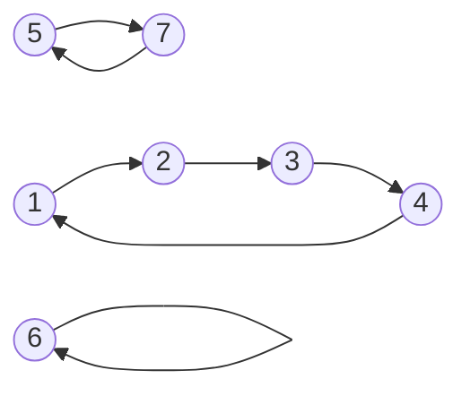

Topics: 
- - -
==Permutacija== na [[Teorija množic|množici]] $A$: vsaka bijektivna [[Relacije#Preslikave|preslikava]] $f:A\rightarrow A$
==Permutacija reda== $n$: permutacija v $\{1,2,\ ... \ ,n\}$
==Simetrična grupa reda== $n$: množica $S_n$ vseh permutacij reda $n$

1. Zapis permutacije s ==tabelo== - v spodnji vrstici so slike števil zgornje vrstice:
$$\varphi= \left(\begin{matrix} 1&2&3&4&5&6&7 \\ 2&3&4&1&7&6&5 \end{matrix}\right)$$
==Identiteta==: $id=\left(\begin{matrix} 1&2&\cdots&7 \\ 1&2&\cdots&7 \end{matrix}\right)$
==Produkt permutacij== $\alpha$ in $\beta$ - $\alpha*\beta$: Najprej uporabiš preslikavo $\alpha$, nato pa na dobljenem še $\beta$
==Inverzna permutacija== $\alpha^{-1}$: Zamenjaš vrstici (in urediš stolpce zgornje vrstice po vrsti)

Pravimo, da sta v permutaciji $\varphi$ števili $1$ in $2$ v inverziji, ker sta v spodnji vrstici tabele v napačnem vrstem redu. Tako je vseskupaj 6 inverzij: $12,13,14,56,57,67$

2. Zapis permutacije z ==disjunktnimi cikli==: $\varphi=(1234)(57)(6)=(3412)(75)$
Graf ([[Relacije|relacije]]) $\varphi$:

==Ciklična struktura permutacije==: število dolžin ciklov v zapisu permutacije z disjunktnimi cikli (npr. ciklična struktura $\varphi$ je $[1,2,4]$)
- ==Fiksna točka==:1-cikel
- ==Transpozicija==: 2-cikel

Za ==potenciranje permutacij== je ugodnejši zapis z disjunktnimi cikli - dovolj je poznati potence ciklov:
Naj bo $\pi=\alpha_1*\alpha_2* \ ... \ *\alpha_m$ permutacija z disjunktnimi cikli $\alpha_i$. Potem je:
$$\pi^k=\alpha_1^k*\alpha_2^k* \ ... \ *\alpha_m^k$$

Naj bo $\alpha$ permutacija enega samega cikla dolžine $n$:
- $\alpha^k$ je sestavljena iz $gcd(n,k)$ disjunktnih ciklov dolžin $\frac n {gcd(n,k)}$
- $\alpha^n=id$  in  $\alpha^{-1}=\alpha^{n-1}$  in je $n$ najmanjše $\mathbb N$ s to lastnostjo

==Red permutacije== $\pi$:
- najmanjši $k\geq 1 \in \mathbb N$, za katerega je $\pi^k=id$
- najmanjši skupni večkratnik dolžin disjunktnih ciklov $\pi$

3. Zapis permutacije s transpozicijami: $\varphi=(12)(13)(14)(57)$
==Parnost permutacije==:
- parnost števila transpozicij v zapisu permutacije s transpozicijami
- parnost števila inverzij v zapisu permutacije s tabelo

==Potenčna enačba==: $\alpha,\beta,\gamma$ so dane permutacije, $\pi$ pa neznana permutacija.
Enačba $\alpha*\pi^k*\beta=\gamma$ je enolično rešljiva: $\pi^k=\alpha^{-1}*\gamma*\beta^{-1}$
#TODO-PRIMERI