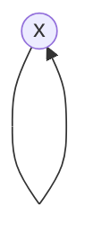
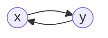
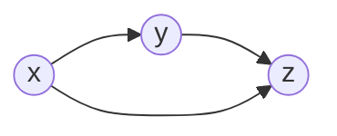
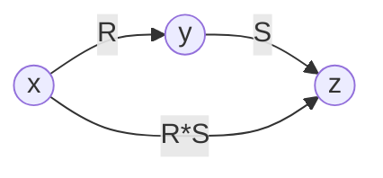

Topics: 
- - -
# Relacije
Relacije so posebne vrste [[Teorija množic|množic]]

==(N-mestna) relacija==: množica urejenih n-teric
==(N-mestna) relacija v množici== A: množica $R\subseteq A\times A\times \ ... \ \times A$
==Prazna relacija==: $\emptyset \subseteq A\times A$
==Univerzalna relacija==: $U_A := A\times A \subseteq A\times A$
==Relacija identitete== na množici A: $id_A=\{(x,x); \ x\in A\}$
Namesto $(x,y)\in R$ pišemo $xRy$
==Domena oz. definicijsko območje== relacije R: $D_R=\{x;\ \exists y:xRy\}$
==Zaloga vrednosti== relacije R: $Z_R=\{y; \ \exists x:xRy\}$

Grafična predstavitev relacije:
- Elemente $A$ predstavimo kot točke v ravnini
- Relacijo med $a$ in $b$ ($aRb$) predstavimo kot usmerjeno puščico od a do b
### Lastnosti relacij
1. Refleksivnost: 
   $$\begin{aligned} \forall x\in A \ : \ xRx \\ id_A \subseteq R \end{aligned}$$

2. Simetričnost:
   $$\begin{aligned} \forall x,y\in A \ : \ xRy &\implies yRx \\ R^{-1}&=R \end{aligned}$$

3. Antisimetričnost:
   $$\begin{aligned} \forall x,y\in A \ : \ xRy \land yRx &\implies x=y \\ R^{-1}\cap R &\subseteq id_A \end{aligned}$$
   
(Ni para nasprotno usmerjenih povezav)

4. Tranzitivnost:
   $$\begin{aligned} \forall x,y,z\in A \ : \ xRy\land yRz &\implies xRz \\ R^2 &\subseteq R \end{aligned}$$

5. Sovisnost:
   $$\begin{aligned} \forall x,y\in A \ : \ x\neq y &\implies xRy \lor yRx \\ id_A \cup R \cup R^{-1} &= U_a \end{aligned}$$
   
(Vsaki dve točki sta povezani)

6. Enoličnost:
   $$\begin{aligned} \forall x,y,z \in A \ : \ xRy \land xRz &\implies y=z \\ R^{-1} * R &\subseteq id_A \end{aligned}$$
   
(Iz vsake točke gre največ ena puščica)

### Operacije z relacijami
Poleg navadnih operacij množic definiramo:
==Komplement==: $R^C:=(A\times A)\setminus R = U_A \setminus R$
==Inverzna relacija== relacije R: $R^{-1}:=\{(y,x); \ (x,y)\in R\}$
==Produkt relacij== R in S: $R* S:=\{(x,y); \ \exists y(xRy \land ySz)\}$
Na grafu:

Lastnosti operacij z relacijami:
1. $(R^{-1})^{-1}=R$
2. $(R*S)^{-1} = S^{-1}*R^{-1}$
3. $(R*S)*T=R*(S*T)=R*S*T$
4. $R*(S\cup T) = R*S \cup R*T$
5. $(R\cup S)*T = R*T \cup S*T$
6. $R*id_A = id_A * R = R$  (nevtralni element)
7. $R\subseteq S \implies R*T \subseteq S*T \ \land \ T*R \subseteq T*S$

==Potence relacij==:
$$\begin{aligned} R^0 &= id_A \\ R^{n+1} &= R^n*R \\ R^{-n} &= (R^{-1})^n \end{aligned}$$
Potence relacij lahko beremo iz grafa: $R^k$ - od $x$ do $y$ se da priti preko $k$ zaporednih povezavah

==Tranzitivna ovojnica== relacije R: $R^+ = \bigcup_{k=1}^\infty R^k$ ... na grafu lahko od $x$ do $y$ pridemo v $\geq 1$ korakih
==Tranzitivno-refleksivna ovojnica== relacije R: $R^* = \bigcup_{k=0}^\infty R^k$ ... na grafu lahko od $x$ do $y$ pridemo v $\geq 0$ korakih

==Ekvivalenčna relacija== je refleksivna, simetrična in tranzitivna
==Ekvivalenčni razred== elementa x: $R[x]=\{y\in A; \ yRx\}$ ... množica vseh elementov, ki so v relaciji z $x$

Relacija R ==delno ureja== relacijo A, če je R refleksivna, antisimetrična in tranzitivna (npr. $\subseteq$ delno ureja množice)
Relacija R ==linearno ureja== relacijo A, če R delno ureja A in je R sovisna (npr. $\leq$ linearno ureja naravna števila)

==Hassejev diagram==: slikovni prikaz delne urejenosti:
- elementi A ... točke v ravnini
- a < b ... a narišemo nižje od b in ju povežemo z daljico
# Preslikave
Relacija $f\subseteq A\times B$ je ==preslikava== iz A v B, če velja:
- f je enolična,
- $D_f=A$
- $Zf\subseteq B$
Pišemo tudi $f:A\rightarrow B$ oz. $y=f(x)$

Preslikava je:
- ==injektivna==: $\forall x,y\in A \ : \ f(x)=f(y)\implies x=y$
- ==surjektivna==: $Z_f=B$
- ==bijektivna==: injektivna in surjektivna

==Identiteta== na A: $id_A \ : \ A\rightarrow A$
==Inverzna preslikava==: $f^{-1} \ : \ B\rightarrow A$ obstaja, le je $f$ bijektivna
==Kompozitum preslikav==: $f\subseteq A\times B \ \land \ g\subseteq B\times C \ \implies \ g\circ f=f*g \ \ (\subseteq A\times C)$

==Dirichletov princip==: Naj bosta $A,B$ končni množici, $f:A\rightarrow B$ ter $|A|=|B|$. Tedaj so naslednje trditve enakovredne:
- $f$ je injektivna
- $f$ je surjektivna
- $f$ je bijektivna
